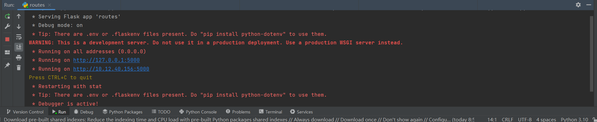
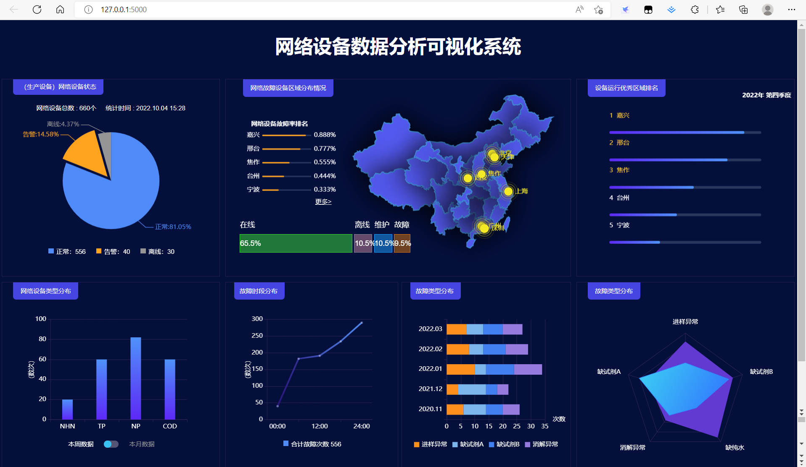

# 生产设备(网络设备)数据分析与可视化系统的设计与实现
# flask-echarts-network-equipment
A single page application with Flask and echarts.\

### 前言
这是一个前端用 echarts，后端用 Python 的 Web 框架 Flask 开发的生产设备(网络设备)数据分析与可视化系统。\
数据来源于：http://analysis.datains.cn/finance-admin/index.html#/admin/dataset/detail/dfe90f126291492ebde29bae9e96dbd1

参考资料来源于：
1. echarts示例：https://juejin.cn/post/7062254510311211044
2. echarts示例：http://192.144.199.210/forum.php?mod=forumdisplay&fid=2
3. echarts示例官网：https://echarts.apache.org/examples/zh/index.html
4. python+flask微框架：https://www.w3cschool.cn/flask/
5. flask部署：https://blog.csdn.net/echo666/article/details/109194054
### 目录结构
先简单看一下项目的目录结构，backend 是 Flask 实现的服务端，frontend 是应用 echarts 实现的前端。

```
.
├── backend
│   ├── app
│   └── venv
└── frontend
    └── dist
          ├── index.html
          └── assets
                ├── css
                └── js
```
> echarts 是渐进式 JavaScript 第三方库。[echarts官网](https://echarts.apache.org/examples/zh/index.html)

> Flask 是一个使用 Python 编写的轻量级 Web 应用框架。[Flask 学习资源](https://dormousehole.readthedocs.io/en/latest/)

再来看一下目前代码的运行效果：



### 开发环境
硬件：
- Windows 10 11th Gen Intel(R) Core(TM) i5-1135G7 @ 2.40GHz   2.42 GHz

软件：
- HBuilder
- Python 3.10.6（pycharm Pro）


### 前端开发

- JQuery库：https://www.w3school.com.cn/jquery/index.asp
- echarts图表库使用：https://echarts.apache.org/zh/index.html

### 后端开发

#### 1、安装Python3

#### 2、创建虚拟环境
Python 虚拟环境可以为 Python 项目提供独立的运行环境，使得不同的应用使用不同的 Python 版本，我们使用虚拟环境开发一个 Python 应用。

新建后端目录
```
$ mkdir backend
$ cd backend/
```

创建虚拟环境
```
python3 -m venv venv
```

激活虚拟环境
```
source venv/bin/activate
```

关闭虚拟环境的命令如下
```
deactivate
```

#### 3、安装 flask

关于 flask 我们在文章最开始已经介绍过。

```
pip install flask
```

如果没有报错，那就就安装成果了。


#### 4、编写代码
关于 flask 代码部分参考了[The Flask Mega-Tutorial教程](https://github.com/luhuisicnu/The-Flask-Mega-Tutorial-zh)，看完第一章就可以写出应用了。解释一下关键代码。

在`__init__.py`中修改python默认html和静态资源目录，这个资源就是我们上面在前端开发中的资源目录，直接引入框架即可。

```
app = Flask(__name__,
            template_folder="../../frontend/dist",
            static_folder="../../frontend/dist/assets")
```

修改完成之后再启动 Flask，访问的就是 "生产设备数据分析可视化" 的页面了。

`routes.py` 里面的代码，就是主页面。

``
    唯一遗憾的是，没有实现前端数据与后台数据的实时更新，只是将前台数据写死实现的一个可视化页面。
``

最后执行`flask run`就可以跑起来了。

当然这是用半天时间跑起来的一个简陋的系统，但是具备了基本的前后端分离应用的功能。

### TODO
- [ ] 服务器部署：flask可通过服务器部署，很简单。不过该系统在本地跑起来的效果也是一样的。
>>>>>>> 4cb5bef (网络设备数据分析可视化系统设计与实现)
>>>>>>> d14e158 (生产设备数据分析可视化系统设计与实现)


=======
#### 参与贡献

1.  Fork 本仓库
2.  新建 Feat_xxx 分支
3.  提交代码
4.  新建 Pull Request

#### 特技

1.  使用 Readme\_XXX.md 来支持不同的语言，例如 Readme\_en.md, Readme\_zh.md
2.  Gitee 官方博客 [blog.gitee.com](https://blog.gitee.com)
3.  你可以 [https://gitee.com/explore](https://gitee.com/explore) 这个地址来了解 Gitee 上的优秀开源项目
4.  [GVP](https://gitee.com/gvp) 全称是 Gitee 最有价值开源项目，是综合评定出的优秀开源项目
5.  Gitee 官方提供的使用手册 [https://gitee.com/help](https://gitee.com/help)
6.  Gitee 封面人物是一档用来展示 Gitee 会员风采的栏目 [https://gitee.com/gitee-stars/](https://gitee.com/gitee-stars/)
=======
